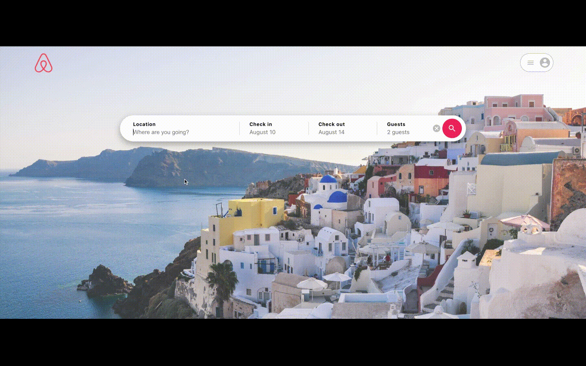

#BnbConnect
#### [Visit the live site](https://bnbconnect.herokuapp.com/home)

BnbConnect is a single-page, full-stack web application modeled after Airbnb and made to focus helping individual to effectively plan their trip. It use React.js and Redux for front-end and Node.js and MongoDB in the back-end. The website hosted on Heroku.


## Technologies
- React/Redux
- Nodejs
- Express.js
- Mongoose
- MongoDb
- JavaScript
- Styled-Components
- Google Maps API
  
## Key features

#### [BnbConnect Design documents](https://github.com/jaytranuts247/bnbconnect/wiki)

#### User Authentication 
- User can sign up and login with existing account
- Invalid login or signup will trigger errors on both front and back end.
- logged in users can access features such as making reservations, write reviews on listings.


```javascript
router.post(
  "/",
  joiValidator(Schemas.userRegister, "body"),
  async (req, res) => {
    const { firstName, lastName, email, password } = req.body;
    console.log(req.body);

    try {
      let user = await User.findOne({ email });

      // check if user is exists
      if (user) return res.status(400).json({ msg: "user already exists" });

      // if not, create new user - mongodb auto add _id to user
      user = new User({
        firstName,
        lastName,
        email,
        password,
      });

      // encrypt password
      const salt = await bcrypt.genSalt(10);
      user.password = await bcrypt.hash(password, salt);

      await user.save(); // save user to db

      // make token and send res
      const payload = {
        user: {
          _id: user._id,
        },
      };

      jwt.sign(
        payload,
        jwtSecret,
        {
          expiresIn: 360000,
        },
        (err, token) => {
          if (err) throw err;
          console.log(token);
          res.json({ token });
        }
      );
    } catch (err) {
      console.log(err);
      res.status(500).send("Server Error");
    }
  }
);
```
#### Listings and Search/Scrapping 
- the Scrapping function will take user search input and start scrapping listings on Airbnb website, push it to BnbConnect database, and then response the corresponding data to the front end. (Scrapping function only works locally, not on live site).
```javascript
export const filterListingInBound = (bounds, coords) => {
  let result = true;

  for (const [key, latLngBound] of Object.entries(bounds)) {
    if (key === "ne") {
      if (latLngBound.lat < coords.lat || latLngBound.lng < coords.lng) {
        result = false;
      }
    }
    if (key === "sw") {
      if (latLngBound.lat > coords.lat || latLngBound.lng > coords.lng) {
        result = false;
      }
    }
  }

  return result;
};

```
- Search bar is integrated with autocompletion widget from Goggle Maps Places API.
- Users can search listings with autocompletion from Google Maps API.

```javascript 
 // * Handle query autocompletion
  useEffect(() => {
    if (window.google) {
      const handleSuggestions = (predictions, status) => {
        if (
          status !== window.google.maps.places.PlacesServiceStatus.OK ||
          !predictions
        ) {
          console.log(status);
          return;
        }
        setRecommendedResults(predictions);
      };
      const autoCompleteService =
        new window.google.maps.places.AutocompleteService();

      autoCompleteService.getPlacePredictions(
        { input: locationInput },
        handleSuggestions
      );
    }
  }, [locationInput]);
```
- Users can explore more listings by moving, zoom in and out maps, more listings will be updated while maps boundary change.

```javascript
  const _onDragEnd = (map) => {
    console.log("_onDragEnd");

    const bounds = {
      ne: map.getBounds().getNorthEast().toJSON(),
      sw: map.getBounds().getSouthWest().toJSON(),
    };
    if (listings) listingsOnMapChange(bounds);
  };
```

```javascript 
export const listingsOnMapChange = (bounds) => async (dispatch) => {
  const config = {
    headers: {
      "Content-Type": "application/json",
    },
  };
  try {
    const res = await axios.post("/api/listings/boundListing", bounds, config);
    console.log("listingsOnMapChange", res.data);
    dispatch({
      type: SET_LISTINGS,
      payload: res.data,
    });
  } catch (err) {
    console.log(err);
    dispatch({
      type: SET_ERROR_LISTING,
      payload: err.message,
    });
  }
};

```

- every listing comes with text description, location information, amenities, reviews, ratings, prices including total prices accroding to user booking date range, calendar that show booking date range, map that show listing location.


#### Bookings
- User can make reservation by pressing reserve button to add listing reservation to their trip.
-  User is unable to make reservation if listing is already reserved.

```javascript

  const handleSubmit = async (e) => {
    e.preventDefault();
    if (!isAuthenticated) {
      setLoginSignUp(true);
      return;
    }

    const booking = {
      listing_id: listing_id,
      guest_id: user._id,
      checkIn: startDate,
      checkOut: endDate,
    };

    console.log("booking", booking);
    let msg = await createUserBooking(booking);
    if (msg === "Your Booking day range is overalapped with others") {
      return;
    }
    history.push("/bookings");
  };
```

```javascript 

export const createUserBooking = (booking) => async (dispatch) => {
  try {
    const config = {
      headers: {
        "Content-Type": "application/json",
      },
    };

    console.log("createUserBooking");
    const res = await axios.post(
      "http://localhost:5000/api/bookings",
      booking,
      config
    );

    // if  user booking date range is overlapping with existing bookings in database
    // then raise the booking error
    if (
      res.data.msg &&
      res.data.msg === "Your Booking day range is overalapped with others"
    ) {
      dispatch({
        type: SET_USER_BOOKING_ERROR,
        payload: res.data.msg,
      });
      return res.data.msg;
    }

    console.log("newBooking", res.data, res.data.guest_id);
    let user_id =
      res.data.guest_id !== undefined ? res.data.guest_id : booking.guest_id;

    dispatch(loadUserBooking(user_id));
  } catch (err) {
    console.log(err, err.message);
    dispatch({
      type: SET_USER_BOOKING_ERROR,
      payload: err.message,
    });
  }
};
```
- User can access their reservation under "Booking" section in the menu dropdown.

```javascript 
// bookings.js route
router.post("/", authMiddleware, async (req, res) => {
  // ....

    // check if booking existed in DB
    const overlappedBookingList = await Booking.find({
      listing_id: req.body.listing_id,
      $nor: [
        {
          $and: [
            { checkIn: { $lt: req.body.checkIn } },
            { checkOut: { $lt: req.body.checkOut } },
          ],
        },
        {
          $and: [
            { checkIn: { $gt: req.body.checkIn } },
            { checkOut: { $gt: req.body.checkOut } },
          ],
        },
      ],
    });

  // ...
}
```

#### Reviews
- User can leave their reviews and ratings for listing they have already made reservation.
- User can rate their booking within six categories - accuracy, communication, cleanliness, location, check-in, and value.
- Listing show the average review rating and update number of reviews every new rating is submitted.

#### User Profile 
- User can access their profile under "Profile" section in dropdown menu.
- Users can create and edit their profile introduction.


